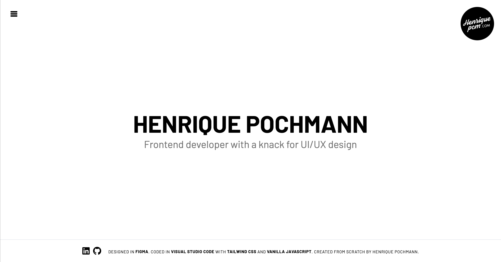

# henriquepcm.com v1 - Built with Vanilla JavaScript and Tailwind CSS

## Description

A single-page, responsive, mobile-first professional website built with JavaScript and Tailwind CSS. This project features a clean, uncluttered interface and a slide-in menu that appears upon clicking the burger icon.

## Screenshot



## Installation and Usage

1.   Running in Visual Studio Code:
     -    Use an extension like Live Server to run the index.html file.
2.   Watching for CSS Changes:
     -    Run the build script to watch for CSS changes:

```sh
   npm run build:css
```

3. Installing Tailwind CSS Packages:

     - When prompted, type "y" to install the required Tailwind CSS packages.

4. Completion:
     - You should now be all set to use the project.

## Features

-    **Responsive Design**: Optimized for all devices, including mobile, tablet, and desktop.
-    **Mobile-First Approach**: Designed with a mobile-first mindset, ensuring a seamless experience on smaller screens.
-    **Single Page Application (SPA)**: All content is displayed on one page, providing a smooth and continuous user experience.
-    **Slide-In Menu**: An elegant slide-in menu that appears when the burger menu is clicked, enhancing navigation.
-    **Fade-In Elements**: Page elements elegantly fade into the screen, adding a touch of sophistication.
-    **Interactive Footer Links**: Footer links with engaging hover-over animations for better user interaction.
-    **Customizable**: Easy to customize and extend, allowing for personalized modifications and additions.
-    **Cross-Browser Compatibility**: Compatible with all modern browsers, ensuring consistent behavior across platforms.

## License

This project is licensed under the [MIT License](LICENSE.md).

## Credits

Created by Henrique Pochmann.

## Contact

You can reach out to me via [LinkedIn](https://www.linkedin.com/in/henriquepcm/), [Twitter](https://twitter.com/henriquepcm/), or henriquepcm@gmail.com.
